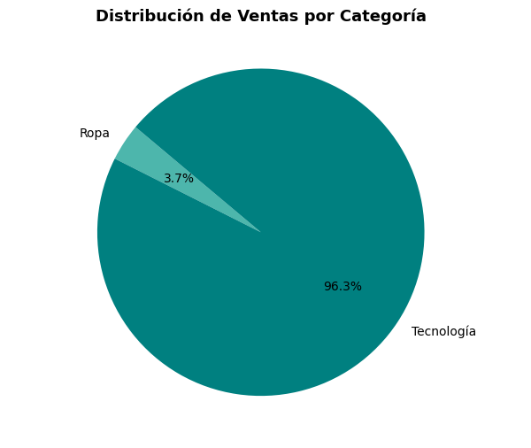
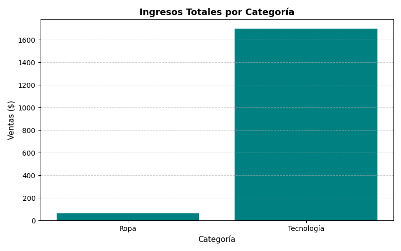

Perfecto, Egla 🙌
Aquí tienes el **README.md final en formato Markdown**, con todo el formato correcto para GitHub y listo para copiar directamente dentro de la carpeta:

> 📁 `Portfolio-BI-Data/Python/mini_proyecto_ventas/README.md`

Incluye:

* encabezados optimizados,
* emojis y formato visual profesional,
* sección completa de **retos + takeaways actualizados**,
* y una plantilla final para registrar futuros aprendizajes técnicos.

---

```markdown
# 🧾 **Mini Proyecto de Ventas – Python**

## 🛒 Descripción general
Este mini-proyecto analiza el comportamiento de ventas de una pequeña tienda, con el objetivo de **detectar los productos más rentables** y **entender las tendencias de ventas mensuales**.  
El proyecto combina **Python + pandas + matplotlib** para procesar datos desde un archivo CSV y generar métricas clave, resúmenes automáticos y visualizaciones exportables.

Forma parte del **Portafolio Profesional BI–Data–Fullstack (Fase 1)**, dentro del sprint de fundamentos de Python.

---

## ⚙️ Tecnologías y librerías utilizadas

| Tecnología | Uso principal |
|-------------|----------------|
| 🐍 **Python 3.14+** | Lenguaje de programación principal |
| 📦 **pandas** | Limpieza, transformación y análisis de datos |
| 🎨 **matplotlib** | Visualización y exportación de gráficos |
| 🧭 **os** | Manejo seguro de rutas relativas |
| 🧾 **CSV** | Fuente de datos (ventas de tienda) |

---

## 📂 Estructura del proyecto

```

Mini_proyecto_ventas/
│
├── analisis_ventas.py       # Script principal
├── ventas.csv               # Dataset de ventas
├── resumen_ventas.txt       # Resumen con métricas generadas
├── assets/                  # Carpeta para gráficas exportadas
│   ├── grafico_barras.png
│   └── grafico_pie.png
└── README.md                # Documentación del proyecto

````

---

## 📘 Dataset: `ventas.csv`

| Columna | Descripción | Ejemplo |
|----------|-------------|----------|
| `order_id` | Identificador del pedido | 1 |
| `product_name` | Nombre del producto | "Mouse" |
| `category` | Categoría del producto | "Tecnología" |
| `quantity` | Unidades vendidas | 2 |
| `price` | Precio unitario | 25.00 |
| `date` | Fecha de la venta | 2025-10-01 |

---

## 💻 Código principal: `analisis_ventas.py`

El código realiza las siguientes operaciones:
1. Carga del dataset usando rutas relativas (`os.path.join()`).
2. Limpieza y conversión de tipos (`to_datetime`, `astype`).
3. Cálculo de métricas de ventas totales, por categoría y productos más vendidos.
4. Generación de visualizaciones con Matplotlib.
5. Exportación del resumen de ventas y gráficos a la carpeta `assets/`.

---

### 🧩 Fragmento de código (resumen)

```python
import pandas as pd
import matplotlib.pyplot as plt
import os

base_path = os.path.dirname(os.path.abspath(__file__))
data_path = os.path.join(base_path, 'ventas.csv')

# Cargar los datos
ventas = pd.read_csv(data_path)

# Control y ajuste de tipos
ventas['date'] = pd.to_datetime(ventas['date'], infer_datetime_format=True)
ventas['category'] = ventas['category'].astype('string')

# Ventas totales
ventas_totales = ventas['price'].sum()

# Agrupar por categoría
ventas_por_categoria = ventas.groupby('category')['price'].sum().reset_index()

# Visualización de resultados
plt.bar(ventas_por_categoria['category'], ventas_por_categoria['price'], color='teal')
plt.title('Ingresos Totales por Categoría')
plt.xlabel('Categoría')
plt.ylabel('Ventas ($)')
plt.tight_layout()

# Guardar gráfico
assets_path = os.path.join(base_path, 'assets')
os.makedirs(assets_path, exist_ok=True)
plt.savefig(os.path.join(assets_path, 'grafico_barras.png'), dpi=300)
plt.close()
````

---

## 📈 Resultados esperados

**Salida en consola:**

```
Ventas totales: $1765.00
Productos más vendidos por cantidad:
  product_name  quantity
1     Camiseta         5
4        Mouse         5
RESUMEN DE VENTAS
Ventas totales ($): 1765.0
Categoría líder: Tecnología
Ventas Categoría Líder ($): 1700.0
Top 2 Productos Más Vendidos: [{'product_name': 'Camiseta', 'quantity': 5}, {'product_name': 'Mouse', 'quantity': 5}]
```

**Gráficos generados en `/assets`:**

* `grafico_barras.png` → Ingresos por categoría
* `grafico_pie.png` → Distribución porcentual de ventas

---

## 📊 Visualizaciones generadas

**Ingresos Totales por Categoría**


**Distribución de Ventas por Categoría**


---

## 🚧 Retos enfrentados y soluciones

| Desafío                                                | Causa técnica                                                                           | Solución aplicada                                                                   |
| ------------------------------------------------------ | --------------------------------------------------------------------------------------- | ----------------------------------------------------------------------------------- |
| ⚠️ **Error “FileNotFoundError” al leer el CSV**        | El script se ejecutaba desde otra ruta.                                                 | Uso de `os.path.abspath(__file__)` y `os.path.join()` para rutas relativas seguras. |
| ⚠️ **Error “No module named 'pandas' / 'matplotlib'”** | La versión activa de Python no tenía las librerías instaladas.                          | Ejecución de instalación directa con `python.exe -m pip install pandas matplotlib`. |
| ⚠️ **Python no se reconocía en PowerShell**            | El alias del Microsoft Store interfería con la llamada a Python.                        | Desactivar alias de ejecución y agregar ruta de Python al PATH del sistema.         |
| ⚠️ **Error de tipos en `date` y `category`**           | El CSV leía las fechas como texto (`object`).                                           | Conversión con `pd.to_datetime()` y `astype('string')`.                             |
| ⚠️ **Gráficos vacíos o sin datos**                     | No se llamaba `plt.tight_layout()` o se cerraba mal la figura.                          | Agregar `plt.tight_layout()` y `plt.close()` para asegurar renderizado correcto.    |
| ⚠️ **Error “invalid syntax” en PowerShell**            | Se intentaba ejecutar un comando de PowerShell dentro del intérprete de Python (`>>>`). | Ejecutar el script siempre desde PowerShell con el operador `&` y ruta completa.    |

---

## 💡 Takeaways técnicos

* 📁 **Rutas relativas seguras:** usar `os.path` garantiza portabilidad.
* 🧠 **Gestión de entornos Python:** verificar versión activa y PATH evita conflictos.
* 📦 **Instalación dirigida:** usar `python.exe -m pip` instala librerías en la versión correcta.
* 🧩 **Depuración consciente:** cada error revela la estructura del stack (entorno → librería → código).
* 🪄 **Automatización de recursos:** `os.makedirs(exist_ok=True)` crea carpetas automáticamente para resultados.
* 🖼️ **Visualización reproducible:** exportar gráficos en `/assets/` facilita integración con GitHub y BI Tools.

---

## 🧠 Reflexión final

> Este proyecto no solo permitió practicar análisis de datos, sino también comprender la importancia de configurar correctamente el entorno de trabajo.
> Los errores relacionados con la lectura, rutas o librerías enseñaron que **la ingeniería de datos comienza con la ingeniería del entorno**.

---

## ✅ Próximos pasos

* Replicar este análisis en **JavaScript** (Sprint 1 – Fundamentos JS).
* Integrar el dataset en **Power BI** (Fase 2 – BI Tools).
* Publicar resultados y gráficas en GitHub.

---

## 🧩 Plantilla para registrar futuros retos y aprendizajes

| Fecha      | Desafío técnico                          | Solución aplicada           | Takeaway                    |
| ---------- | ---------------------------------------- | --------------------------- | --------------------------- |
| YYYY-MM-DD | Describe brevemente el error o situación | Qué hiciste para resolverlo | Qué aprendiste o mejorarías |

> 📘 *Ejemplo:*
> 2025-10-11 | Error `ModuleNotFoundError` al ejecutar script | Instalé `matplotlib` usando la ruta completa del ejecutable de Python | Verificar siempre la versión activa antes de instalar librerías.

---

🧩 **Autor:** *Egla Rivas Chan*
📆 **Última actualización:** Octubre 2025
📁 **Proyecto:** *Mini Proyecto de Ventas – Portafolio Profesional BI–Data*
